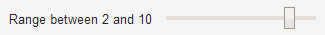
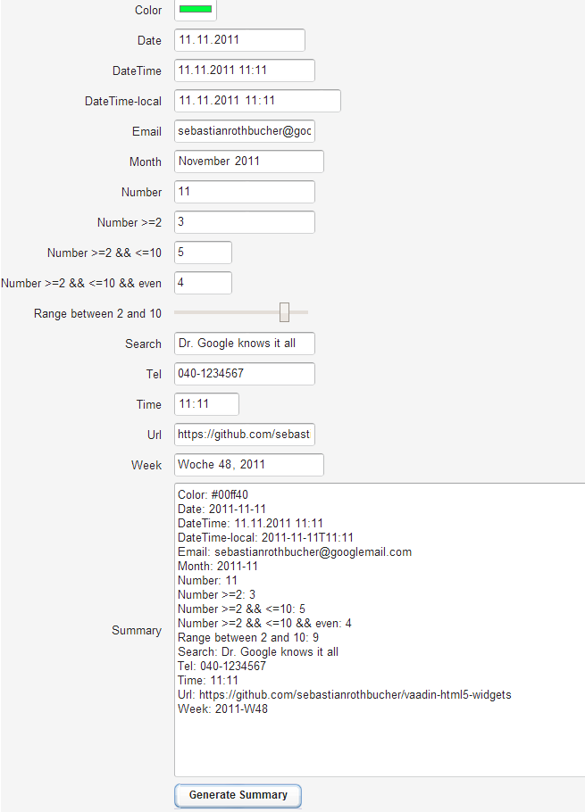

vaadin-html5-widgets
====================

Simple Wrappers for HTML5-inputs for vaadin

Input types like tel or number have long since been useful in the mobile web world as smartphones' virtual keyboards were right the first time. Users didn't have to bother with the nerve-wracking task of switching every time. 

With the new and cool browsers, this thing has even arrived at the desktop - allowing for correctly entering a date or choosing a color with nothing but the browser. 

Whether mobile or desktop: to use these cool new features in [vaadin](http://www.vaadin.com) is the aim of this project: it extends the TextField and changes the input type. For Number and Range it also supports setting vital attributes. Here's how you do that: 
```java
	ColorField colorField = new ColorField();
	colorField.setCaption("Color");
	layout.addComponent(colorField);
```
There is a sample app available - pls. find the details below.

Feel free to share your insights, thoughts and feedback via PR or to sebastianrothbucher AT googlemail DOT com


## Some cool input types

With screenshots from the vaadin test app (see below for how to make it work) running in Chrome (as of July 20, 2014): 

Color picker: <br />

Date picker: <br />

Date and timer picker: <br />

Month picker: <br />

Number picker: <br />

Number picker (limited by range and step): <br />

Range (other way of picking a number): <br />

Search (allows clearing): <br />

Time picker: <br />

Week picker: <br />


## Using the elements in your own project

Take the following steps to spice up your vaadin project with the cool HTML5 elements (you can also copy and paste from the sample at vaadin-html5-widgets-test)

- You have to clone / download and mvn install at least vaadin-html5-widgets-core
- You have to include this one as jar into the project you want to use the fields in
- You have to include this one as jar and source-jar into the project you compile your widgetset with
- You have to create a custom widgetset (if you don't already have one) and include the Html5 widgets there like this (check out the .gwt.xml of vaadin-html5-widgets-test for one way of how to do that): 
```xml
	<inherits name="de.sebastianrothbucher.vaadin.html5.Html5Widgets" />
```
- You have to have maven widgetset compilation in place (check out the POM of vaadin-html5-widgets-test for one way of how to do that)
- You can now use de.sebastianrothbucher.vaadin.html5.widgetset.ColorField and others (return values are Strings - at least for now)
- Have fun!

In case you want to check out the sample first, take these steps (assuming Eclipse): 
- Check out the whole repo and mvn install with Widgetset the partent project vaadin-html5-widget
- Do an mvn eclipse:eclipse to generate the artifacts for there as well; the two above come out as
```
	mvn install eclipse:eclipse -Pwidgetset
```
- Now you can import as existing projects into eclipse (you'll have vaadin-html5-widget-core and vaadin-html5-widget-war)
- To use the server plugin, go to the properties of vaadin-html5-widget-test and change the Java version in the facet (in "Project Facets") to the one given in the "Java Compiler" section; go to "Deployment assembly" and kick out vaadin-html5-widget-core, then re-add it (Project and so on). Finally add target/vaadin-html5-widgets-test-1.0-SNAPSHOT as a folder (also in "Deployment assembly") so the widgetset is available
- To use the server plugin, (furthermore) go to the properties of vaadin-html5-widgets-core change the Java version in the facet (in "Project Facets") to the one given in the "Java Compiler" section
- Deploy to a local tomcat and point your browser to http://localhost:8080/vaadin-html5-widgets-test/
- as ever: Have fun!

BTW: it will look like this: <br />

